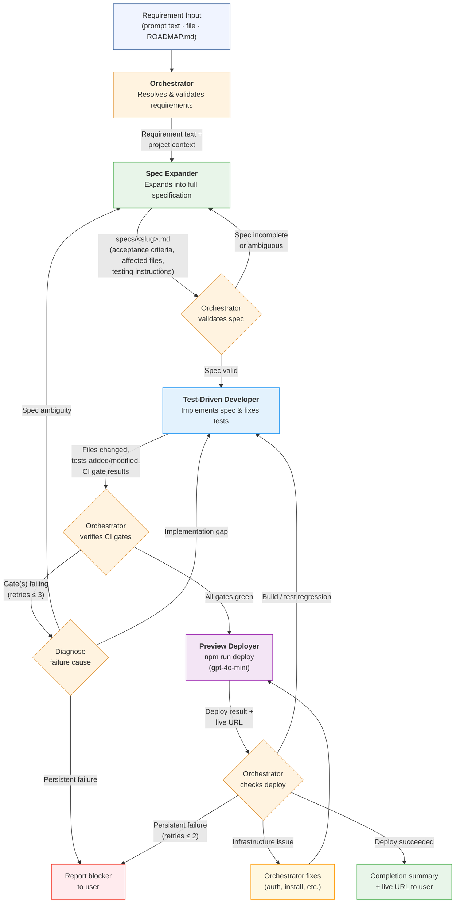

# Agent System

This directory contains the custom Copilot agents that power the automated development
pipeline for the portfolio website. Together they form a three-stage workflow that takes a
raw requirement and delivers tested, CI-green code.

---

## Agent overview

| Agent | File | Model | Role |
|-------|------|-------|------|
| **Orchestrator** | `orchestrator.agent.md` | Default | Top-level coordinator. Receives requirements, delegates work to the other three agents, monitors progress, and handles blockers. |
| **Spec Expander** | `spec-expander.agent.md` | Default | Translates terse requirements into detailed, testable specification files in `specs/`. |
| **Test-Driven Developer** | `test-driven-developer.agent.md` | Default | Implements a specification by writing/updating source code and driving all CI gates (unit tests, lint, E2E) to green. |
| **Preview Deployer** | `preview-deployer.agent.md` | `gpt-4o-mini` | Runs the six-phase deployment pipeline (`npm run deploy`) and reports the live Firebase Hosting URL or a structured failure report. |

---

## Data flow



---

## Detailed agent descriptions

### Orchestrator (`orchestrator.agent.md`)

The entry point for all feature work. It owns the requirement from intake to completion and
ensures the user never needs to invoke the downstream agents directly.

**Responsibilities:**

- **Intake** — Resolves the requirement source (prompt text > referenced file > ROADMAP.md).
- **Delegation** — Passes requirements to Spec Expander, then passes the generated spec to
  Test-Driven Developer.
- **Validation** — Checks that spec files contain all required sections and that all CI
  gates pass after implementation.
- **Recovery** — Diagnoses blockers (spec ambiguity, implementation gaps, dependency issues)
  and re-invokes the appropriate agent with targeted guidance.
- **Reporting** — Provides a completion summary: files changed, tests status, and any
  decisions that need reviewer attention.

**Key inputs:** Requirement text, file path, or ROADMAP.md heading.  
**Key outputs:** Completion summary with CI status; all source changes committed.

---

### Spec Expander (`spec-expander.agent.md`)

Bridges the gap between a one-liner requirement and a fully-specified, testable change. Its
output gives the Test-Driven Developer everything needed to implement without further
clarification.

**Responsibilities:**

- **Current-state analysis** — Reads relevant source files and existing tests to document
  how things work today (with file + line citations).
- **Requirement expansion** — Produces numbered, testable requirements with calculated
  values, design-token changes, and affected-file inventories.
- **Acceptance criteria** — Writes Given/When/Then statements for every observable outcome.
- **Test planning** — Identifies existing tests that will be impacted and proposes new tests
  with layer, file path, and plain-English descriptions.

**Key inputs:** Requirement text + project context from the Orchestrator.  
**Key outputs:** `specs/<slug>.md` — a Markdown specification file following a strict
template (Summary, Current behaviour, Requirements, Design-token changes, Affected files,
Acceptance criteria, Testing instructions, Implementation notes, Out of scope).

---

### Test-Driven Developer (`test-driven-developer.agent.md`)

A strict TDD practitioner that implements features by making tests pass. It works through
four sequential phases and never marks work as done until every CI gate is green.

**Responsibilities:**

- **Unit & component tests (Vitest)** — Runs the fastest tests first; for each failure,
  reads the test and implementation, applies the minimal source-code fix, and re-runs.
- **Lint & type checks** — Ensures no type errors or lint violations were introduced.
- **E2E tests (Playwright)** — Covers full-page flows as the final gate; manages dev server
  startup and browser binary installation.
- **Test integrity** — Only edits a test file when it demonstrably contradicts documented
  requirements. Prefers structural assertions over content/design-value assertions.

**Key inputs:** Path to a spec file in `specs/`.  
**Key outputs:** Report of files changed, tests added/modified, CI gate exit statuses, and
any temporary tests (documented in `agent-output/<feature-slug>-temp-tests.md`).

---

### Preview Deployer (`preview-deployer.agent.md`)

A lightweight deployment runner using `gpt-4o-mini` (non-premium model, suitable for
deterministic scripted tasks). It executes the project's six-phase pipeline and surfaces a
clear success or failure report.

**Responsibilities:**

- **Pre-flight checks** — Verifies `firebase-tools` is installed, the CLI is authenticated,
  and `.firebaserc` is present before touching anything.
- **Pipeline execution** — Runs `npm run deploy` (or `--skip-local` when CI was already
  verified by the orchestrator), capturing all output.
- **Success reporting** — Provides the live Firebase Hosting URL, a phase-by-phase status
  table, and post-deployment recommendations.
- **Failure reporting** — Identifies which phase failed, extracts the relevant error output,
  diagnoses the likely root cause, and lists numbered, specific remediation steps.

**Key inputs:** Optional `--skip-local` flag from the Orchestrator.  
**Key outputs:** Live URL (`https://<project-id>.web.app`) on success; structured failure
report with diagnosis and fix steps on error.

**Model:** `gpt-4o-mini` — this agent performs a well-defined, scripted task and does not
require a premium reasoning model.

---

## Artefact locations

| Artefact | Path | Purpose |
|----------|------|---------|
| Specification files | `specs/<slug>.md` | Detailed, testable specs produced by Spec Expander |
| Temporary test notes | `agent-output/<slug>-temp-tests.md` | Documents content/design-specific tests with removal conditions |
| Architecture rules | `.github/copilot-instructions.md` | Canonical constraints all agents must follow |
| Roadmap | `ROADMAP.md` | Source of prepared requirements (Priority 3 input) |

---

## Invocation examples

```
# Full pipeline from a prompt requirement (spec → implement → deploy)
@orchestrator Add a skills breakdown section to the about page with categorised tags

# Full pipeline from ROADMAP.md
@orchestrator Process prepared requirements

# Spec only (no implementation, no deploy)
@spec-expander Add a skills breakdown section to the about page

# Fix failing tests after a manual code change
@test-driven-developer All tests

# Deploy only (CI already green)
@preview-deployer --skip-local
```
