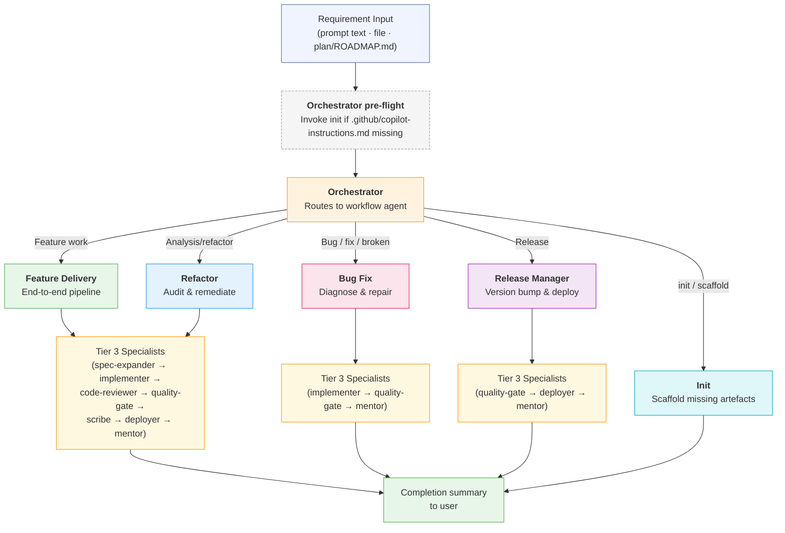

# Agent System

This directory contains reusable Copilot agents that form an automated development
pipeline. Together they provide a three-tier workflow that takes a raw requirement and
delivers tested, CI-green, deployed code. These agents are designed to be **generic** —
they discover the project's technology stack, conventions, and tooling at runtime rather
than hard-coding framework or language specifics.

For guidance on adapting these agents to a new repository, see
[ADAPTING.md](../../ADAPTING.md) in the repository root.

---

## Agent overview

### Tier 1 — Intent router

| Agent | File | Role |
|-------|------|------|
| **Orchestrator** | `orchestrator.agent.md` | Top-level coordinator. Parses user intent and delegates to the appropriate Tier 2 workflow agent. |

### Tier 2 — Workflow agents

| Agent | File | Role |
|-------|------|------|
| **Feature Delivery** | `feature-delivery.agent.md` | End-to-end feature pipeline: spec → implement → review → test → deploy → learn. |
| **Bug Fix** | `bug-fix.agent.md` | Diagnoses and repairs defects: reproduce → root-cause → fix → regress-test → verify → learn. |
| **Refactor** | `refactor.agent.md` | Analysis & remediation: audit → triage → fix → verify → deploy → learn. |
| **Release Manager** | `release-manager.agent.md` | Production releases: version bump → changelog → quality gate → deploy → tag → learn. |

### Tier 3 — Specialist agents

| Agent | File | Role |
|-------|------|------|
| **Spec Expander** | `spec-expander.agent.md` | Expands terse requirements into detailed, testable spec files in `specs/`. |
| **Implementer** | `implementer.agent.md` | Writes and modifies code in a strict test-driven discipline. |
| **Code Reviewer** | `code-reviewer.agent.md` | Reviews code for smells, design issues, and AI-generated code pitfalls. |
| **Architect** | `architect.agent.md` | Audits codebase architecture against project standards and best practices. |
| **Quality Gate** | `quality-gate.agent.md` | Runs CI suite with auto-fix feedback loop via the implementer. |
| **Designer** | `designer.agent.md` | Proposes and implements visual redesigns across the UI layer. |
| **Scribe** | `scribe.agent.md` | Generates and maintains per-folder README documentation. |
| **Deployer** | `deployer.agent.md` | Runs the deployment pipeline and reports the outcome. |
| **Mentor** | `mentor.agent.md` | Analyses sessions to extract lessons and improve agent instructions. |
| **Init** | `init.agent.md` | Idempotent project scaffolding: ensures all pipeline artefacts and config files exist. Invoked manually or as an orchestrator pre-flight step. |

---

## Data flow



---

## How agents discover the project

These agents do **not** hard-code technology-specific commands or file paths. Instead,
each agent begins with a **discovery phase** where it reads:

1. **`.github/copilot-instructions.md`** — the project's architecture rules, conventions,
   and constraints. This is the single source of truth for project-specific standards.
2. **Project configuration files** — dependency manifests (`package.json`, `Cargo.toml`,
   `go.mod`, etc.), compiler config, framework config, and CI configuration.
3. **`plan/ROADMAP.md`** — planned features and prepared requirements.

Agents adapt their behaviour based on what they discover — using the correct test commands,
lint tools, build steps, and deployment procedures for the project at hand.

---

## Artefact locations

| Artefact | Path | Purpose |
|----------|------|---------|
| Specification files | `specs/<slug>.md` | Detailed, testable specs produced by Spec Expander |
| Archived specs | `specs/archive/<slug>.md` | Completed specs moved here after feature delivery |
| Temporary test notes | `agent-output/<slug>-temp-tests.md` | Documents temporary tests with removal conditions |
| Architecture rules | `.github/copilot-instructions.md` | Canonical constraints all agents must follow |
| Roadmap | `plan/ROADMAP.md` | Source of prepared requirements (Priority 3 input) |
| Bug tracker | `plan/BUG_TRACKER.md` | Tracks open bugs and their status |
| Changelog | `CHANGELOG.md` | Release history maintained by release-manager |
| Architect report | `agent-output/Architect-Review.md` | Output of the architect agent |
| Code review report | `agent-output/Code-Review.md` | Output of the code-reviewer agent |
| Design summary | `agent-output/design-summary.md` | Output of the designer agent |

### Skills

On-demand knowledge modules in `.github/skills/<name>/SKILL.md`. Agents load these at
runtime when needed — they are never included by default.

| Skill | Path | Loaded by |
|-------|------|-----------|
| **git-ops** | `.github/skills/git-ops/SKILL.md` | release-manager, bug-fix, feature-delivery (when branching) |
| **security-audit** | `.github/skills/security-audit/SKILL.md` | code-reviewer, architect |

### Prompts

Slash-command parameterised tasks in `.github/prompts/<name>.prompt.md`.

| Prompt | File | Purpose |
|--------|------|---------|
| **fix-bug** | `fix-bug.prompt.md` | Describe a bug; get structured diagnosis and fix |
| **quick-review** | `quick-review.prompt.md` | Review a file, branch, or project for code smells |
| **write-test** | `write-test.prompt.md` | Generate tests for a target file or module |

### Instructions

Auto-applied conventions scoped to file globs, in `.github/instructions/`.

| File | Applies to | Purpose |
|------|------------|---------|
| `test.instructions.md` | `**/*.test.*`, `**/*.spec.*` | Test structure, assertion style, mocking rules |
| `api.instructions.md` | `**/api/**`, `**/routes/**`, etc. | Input validation, structured errors, auth/rate-limit conventions |

---

## Invocation examples

```
# Scaffold a new project (or fill gaps in an existing one)
@orchestrator Initialise the project
@init

# Full feature pipeline from a prompt requirement
@orchestrator Add rate limiting to the API

# Full pipeline from plan/ROADMAP.md
@orchestrator Process prepared requirements

# Bug fix from a description
@orchestrator Fix the login page crashing on empty email input

# Spec only (no implementation)
@spec-expander Add a caching layer to the data access module

# Fix failing tests after a manual code change
@implementer All tests

# Analyse the codebase architecture
@orchestrator Analyse the codebase

# Deploy to production
@orchestrator Deploy to production

# Review a specific file
@code-reviewer scope:file target:src/auth/login.ts

# Quick review via prompt
/quick-review src/api/users.ts focus:security

# Write tests via prompt
/write-test src/checkout/cart.ts
```
